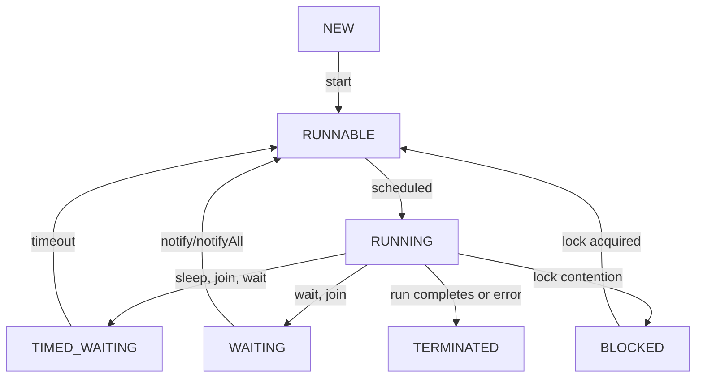

# Threads and Processes
By default, programming languages are sequential which means they execute the commands line by line

The most crucial reason for multi-threading is to separate multiple time-consuming tasks that might be subject to interference by execution of other tasks

### What is multi-threading?
Multi-Threading is the ability of the CPU to execute multiple process or threads concurrently

### Process
It is an instance of a Program execution

Each Process has its Registers, Program Counter (PC), Stack Memory and Heap Memory which are assigned by OS

Example : Opening word, browser etc are all different processes

##### Creating a process is an Expensive Operation

### Threads
Thread is essentially a light-weight process.

It is a unit of execution within a given process. So a single process can contain multiple threads

Each thread in a process share the memory and resources and this is why we need to deal with Concurrent Programming

### Time-Slicing Algorithm
This states that if we have suppose 2 thread and 1 CPU, then the CPU will handle the first thread for short duration of time, then it will handle thread 2 for short duration and then again thread 1 and so on.

### Downside of Multithreading
Since multiple threads share memory and resources, so Synchronization is not straight forward and needs to be taken care of.

Not easy to design and test.

Using multiple threads is expensive

### Rule of THUMB
For small applications, it is unnecessary to use multiple threads.

A key rule of thumb in multithreading is to use as few threads as possible. If adding another thread doesn't noticeably improve performance, responsiveness, or user experience, it's likely unnecessary. 

### Thread Lifecycle

